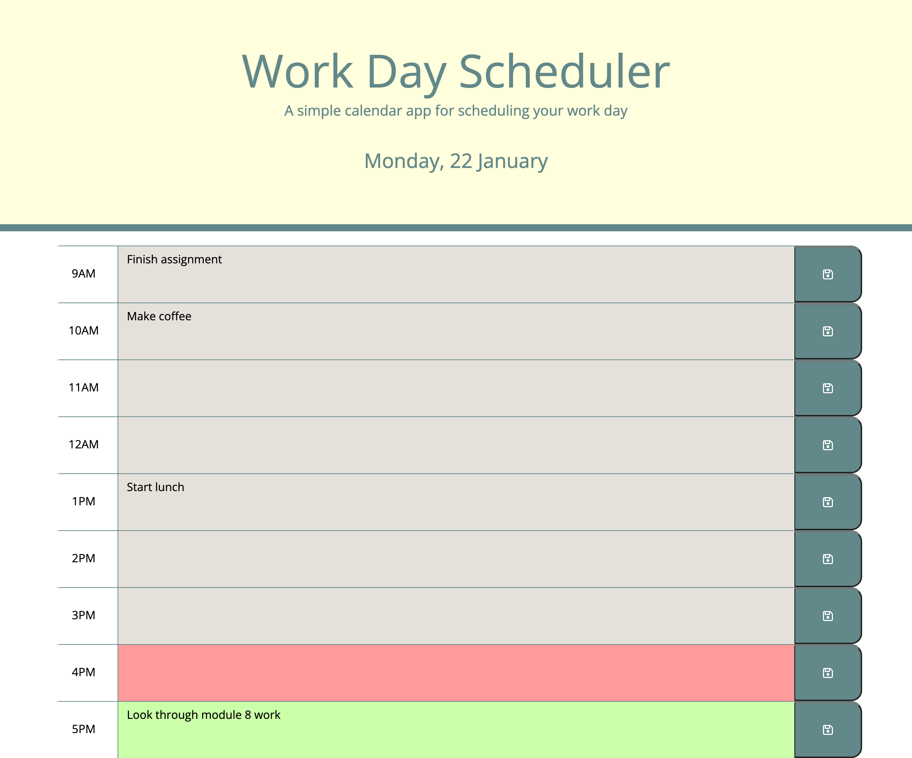

# Daily-Planner

## Description

A single day work schedule to help plan out those busy days. The project provides the current date along with work day time blocks with 1 hour increments.
The user can add events to the schedule and save the input via the save button provided at each block. Time blocks are colour coded based on
the past, present and future hour in any given day. Events are stored locally when saved to prevent them from dissapearing on refresh.

[Deployed app](https://chriss-88.github.io/Daily-Planner/)

## Screenshot

## Credits

- [Font Awsome](https://fontawesome.com/)
- [Bootstrap](https://getbootstrap.com/)
- [Day.js](https://day.js.org/en/)

## License

N/A
